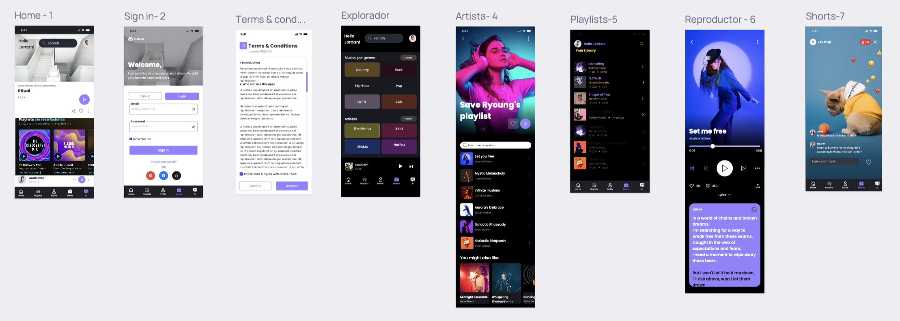
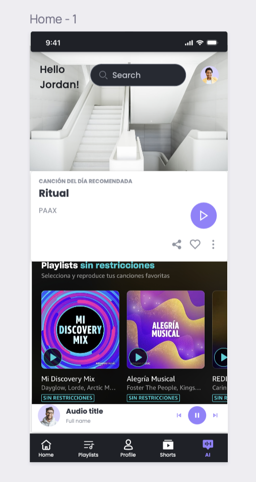
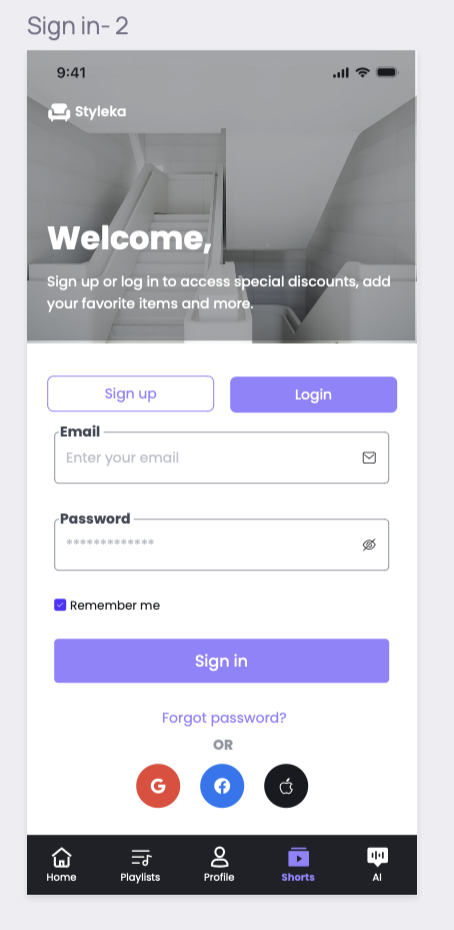
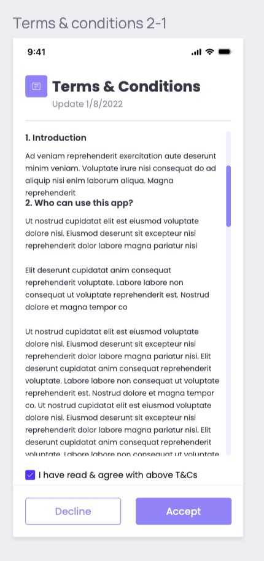
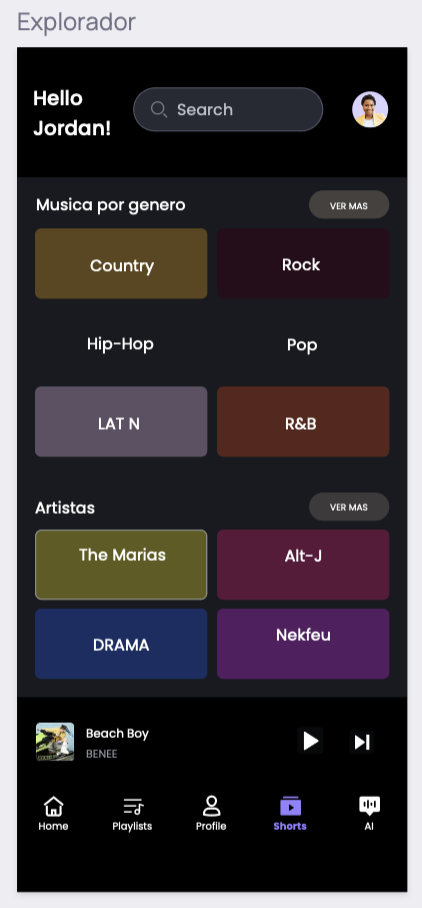
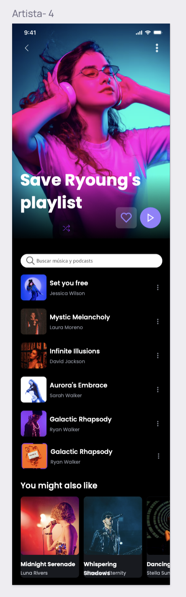
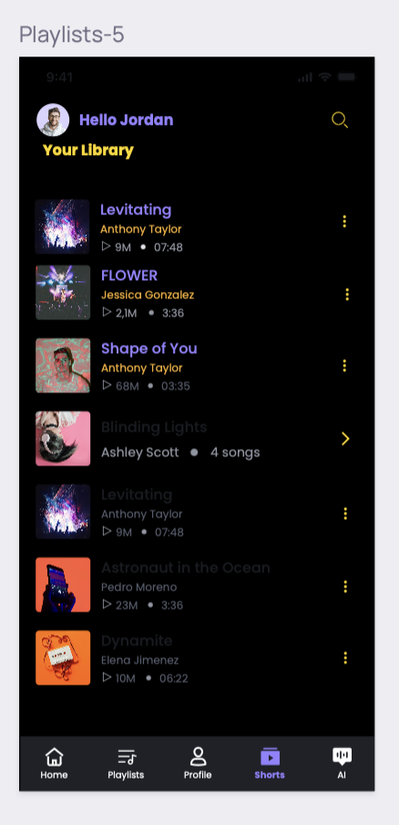
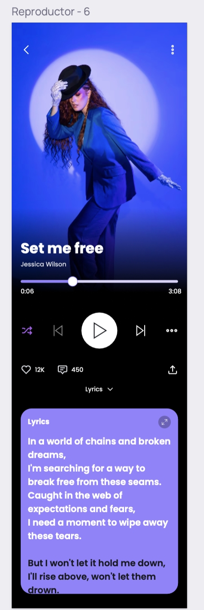
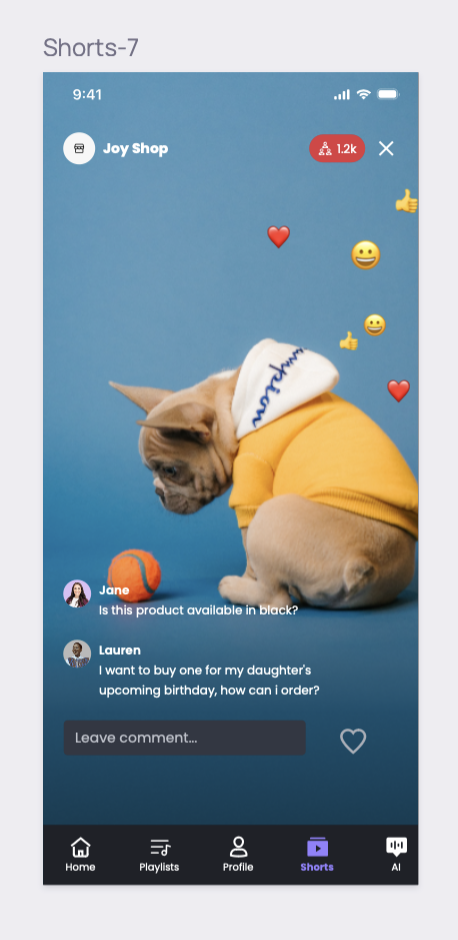

# AI-Ritmo

## Musical platform with AI 

To preview the design you can see it here 
##Branches##
[Github Link Elizabeth](https://github.com/TomasCEI/ai-ritmo.git) 
[Github Link Dera](https://github.com/TomasCEI/ai-ritmo.git)

### Within AI-Ritmo you will find the following: 

1. **Home**

Where you can visualize a welcoming message with your profile picture next to the search, the nav bar, recommeded playlists and the song of the day. 

The AI is placed inside of the menu where you can talk at any time. 

2. **Sign up, Log in & T&C **

 This screen allows you to either sign in or log in in the same screen and you are sent as well to the **Terms and agremments** 

3. **Explorer of genres**

 You are encouraged to search here among the variety of genres. 

 | Genres | Artists |
 |--------| --------|
 | Jazz   |  Pomplamoose |
 | Indie  |  Palace |
 | Alternative | Alt-J |

4. **Artist's page**

 Here you can view the music of specific artists and browse among their songs. 

5. **Your Library**

 In the Library you can browse your added playlists. 

6. **Player**

In the player you visualize the song, the lyrics and the controls. 

7. **Shorts** 

The shorts are videos that are suggested by the AI of music you would like.  

