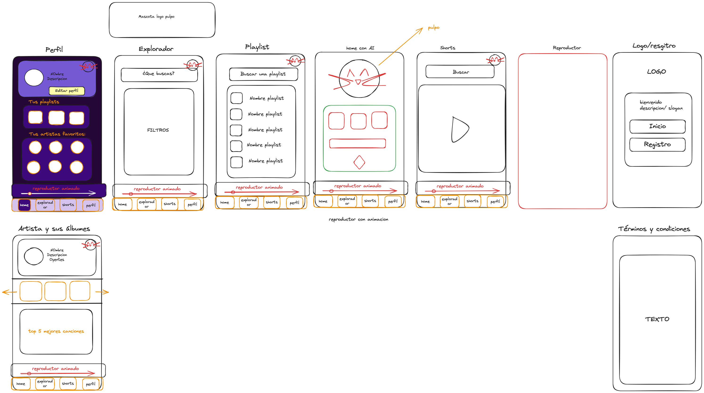

## Plataforma De musica con mucho ritmo

# Ai-Ritmo -  Romina - Alba R

Este proyecto consiste en la realización de una app movil de música donde la protagonista es la inteligencia artificial.
En este caso, nuestro protagonista se llama Lody, un simpático pulpo que conecta todos los tipos de música en una sola app.
Su nombre viene de la palabra "Melody", en español melodía.

### Identidad visual

En primer lugar, el color protagonista de esta app es el violeta, dado que es el color de la calma, la creatividad, el misterio, la magia y la meditación, términos que pueden estar presentes en los distintos géneros musicales.
La tipografía escogida es "Quicksans", proveniente de GoogleFonts, que se caracteriza por sus acabados redondeados y que se complementan a la perfección con el estilo dinámico de nuestra app.

En segundo lugar, el logo representa a Lody haciendo uso de unos cascos para escuchar música junto al nombre de la app "Ai-Ritmo".
Los iconos de la app vienen de FontAwesome, una librería de fuentes e íconos basado en CSS.
Las imágenes provienen de Pexels, un banco de imágenes de libre uso.

### Páginas y contenido

1. Inicio de sesión y Registro para acceder a la app, con nombre de usuario o el e-mail.
2. Términos y condiciones
3. *Home*, donde se encuentra Lody, para ofrecernos diferentes funcionalidades.
4. Explorador, para realizar búsquedas de canciones y playlist.
5. *Shorts*, donde puedes ver pequeños clips de las canciones de los artistas en formato video.
6. Perfil, donde el usuario tendrá su información personal, sus playlist y sus artistas favoritos.
7. Perfil del artista, sus álbumes y sus top 5 canciones.
8. *Playlist* del usuario. 

### Especificaciones del código

Este proyecto está codificado para ser visualizado en formato móvil, siguiendo la regla Mobile-First, adaptándose concretamente a la anchura y altura del Iphone XR.

El código CSS se encuentra escrito siguiendo la nomenclatura Suit CSS.

Dentro de los archivos del proyecto encontramos todos los HTML y tres carpetas que separan los css creados, las imágenes usadas en la creación de la app y las funcionalidades de Javascript.

***

