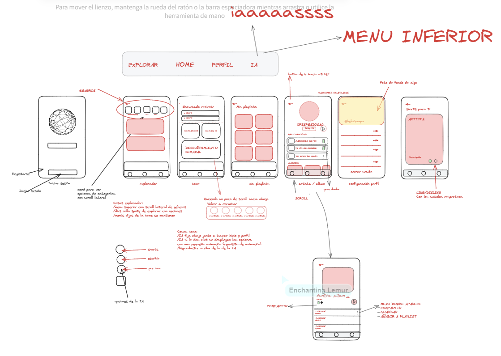

# ai-ritmo
Plataforma De música con mucho ritmo

## Grupo: Belu y Cris

## Estructura de páginas:
- Inicio de sesión.

- Registro (enlazada a página de términos y condiciones).

- Home: Es donde aparecen los contenidos que has escuchado recientemente o lo que te recomienda la aplicación.

- Explorador: Tiene un menú superior con scroll lateral para navegar entre categorías de la sección. Cada una de ellas mostrará un contenido diferente.

- Mis playlists: Página donde se guardan tus playlists.

- Artista/Album: Aparece una imagen del artista, con la opción de poder seguirle, después las canciones que más escucha la gente y en la parte inferior los álbumes que tiene con un scroll lateral para hacer uso de esta característica ya mencionada en el explorador.

- Configuración de perfil: Aparece una imagen que hayas elegido al crear la cuenta y tu nombre de usuario o una imagen por defecto. Debajo habrán opciones de preferencias de la cuenta y el botón para cerrar sesión al final del todo.

- Shorts: Aparecerán los vídeos que te recomienda la IA, cada vídeo ocupará el alto completo de la ventana y tendrá un scroll vertical para buscar otros vídeos. A demás aparecerá el nombre del artista de la canción, una breve descripción y dos botones donde podrás darle like o dislike al contenido.

## Características:

- Todas las ventanas tienen una flecha en la esquina superior izquierda para volver hacia atrás.

- En la parte inferior de la ventana estarán fijos el reproductor de música con lo último que habías escuchado y el menú (opción de ir a las páginas: explorar, home, perfil e IA). _**Las excepciones son la ventana de configuración de perfil y la de shorts que solo tendrá la barra de navegación y no del reproductor**_ 

- En el menú inferior está el botón de la IA, que tendrá una animación, en la cual si le das aparecen 3 botones que te dan las opciones de preguntarle a la IA **escribiendo, por voz o a través de los shorts.** Si le vuelves a dar click se esconde el menú.

## Diseño de las pantallas:

## Enlaces de interés

* Enlace a nuestro [Trello](https://trello.com/b/71lAihPv/airitme/) para ver la organización de tareas.

* Enlace a nuestro [Excalidraw](https://excalidraw.com/#room=e0ecf7656b178379984b,qVqirQoaqW5HEZZu8rljsQ/) para ver el diseño de las pantallas.
